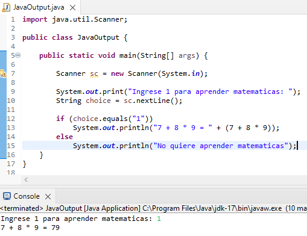
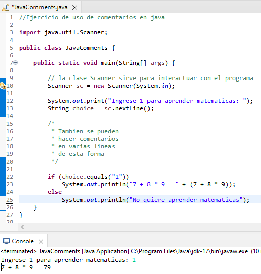
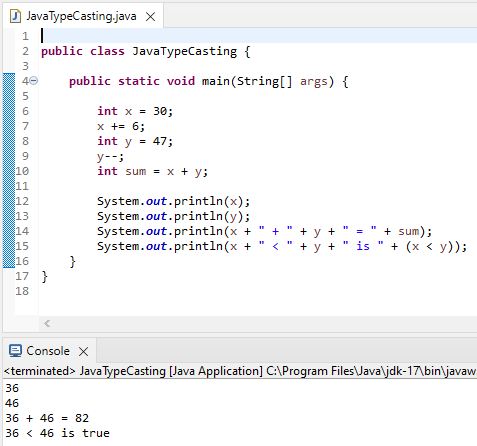
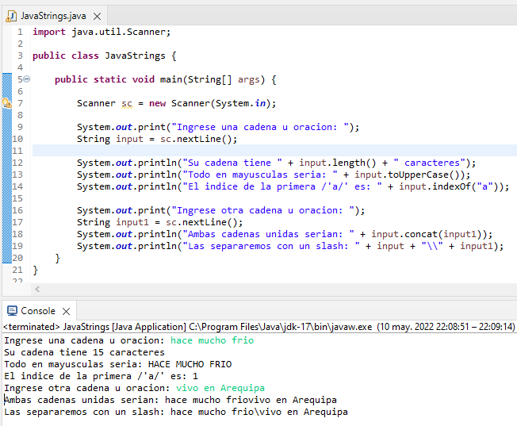
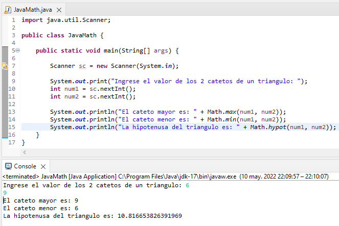
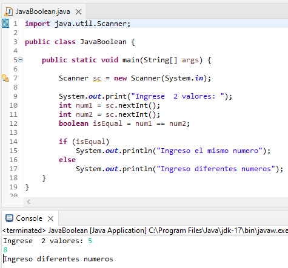
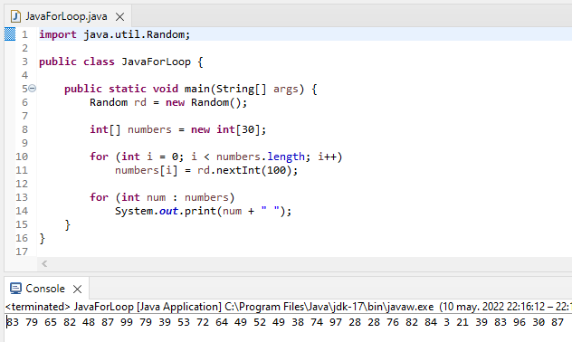
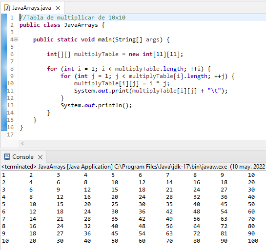
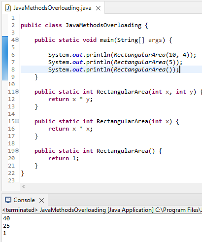
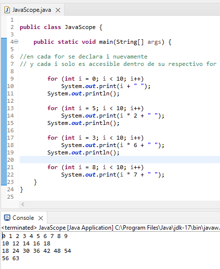



||
**UNIVERSIDAD NACIONAL DE SAN AGUSTIN**

**FACULTAD DE INGENIERÍA DE PRODUCCIÓN Y SERVICIOS**

**ESCUELA PROFESIONAL DE INGENIERÍA DE SISTEMA**
||
| :-: | :-: | :-: |
|**Formato:** Guía de Práctica de Laboratorio / Talleres / Centros de Simulación|
|**Aprobación:  2022/03/01**|**Código: GUIA-PRLE-001**|**Página: 18**|

**INFORME DE LABORATORIO**

**(formato estudiante)**

|**INFORMACIÓN BÁSICA**|
| :-: |
|**ASIGNATURA:** |`	`Estructura de Datos y Algoritmos|
|**TÍTULO DE LA PRÁCTICA:** |Revisión de elementos de programación (Parte I)|
|**NÚMERO DE PRÁCTICA:**|01|**AÑO LECTIVO:**|2022 A|**NRO. SEMESTRE:**|III|
|**FECHA DE PRESENTACIÓN**|10-May-2022|**HORA DE PRESENTACIÓN**|22:40|
|
**INTEGRANTE (s):** 

Vizcarra Gallegos Elias Eduardo – evizcarraga@unsa.edu.pe

|**NOTA:**||
|
**DOCENTE(s):**

Richart Smith Escobedo Quispe - rescobedoq@unsa.edu.pe

|

|**SOLUCIÓN Y RESULTADOS**|
| :-: |
|
I. **SOLUCIÓN DE EJERCICIOS/PROBLEMAS**

                   

|
|
II. **SOLUCIÓN DEL CUESTIONARIO**

- **¿Por qué Git y GitHub son herramientas importantes para el curso?**

Para poder verificar el proceso de trabajo y participación de cada alumno, además de ser una herramienta indispensable para cualquier ingeniero de sistemas ya que comúnmente en el mundo laboral de la programación se trabaja en grandes equipos de trabajo.

- **¿Qué conductas éticas deberían promocionarse cuando se usa un Sistema de Control de Versiones?**

Registrar correctamente todos los cambios hechos en cada versión y no utilizar código de fuentes externas sin permiso.

- **¿Qué son los estándares de codificación?**

Son un conjunto de buenas prácticas que, aunque no sean obligatorias forman parte de un paradigma de programación cuya función es estandarizar la manera de escribir código para así hacerlo más entendible para todos y al mismo tiempo evitar complicaciones.

|
|
III. **CONCLUSIONES**

En este laboratorio aprendimos a usar Git, Github y vim, sus comandos, uso de repositorios, control de versiones, etc. Al resolver ejercicios de sobre Java

|

|**RETROALIMENTACIÓN GENERAL**|
| :-: |
|

|

|**REFERENCIAS Y BIBLIOGRAFÍA**|
| :-: |
|
[*https://www.w3schools.com/java/default.asp*](https://www.w3schools.com/java/default.asp)

[*https://git-scm.com/book/es/v2*](https://git-scm.com/book/es/v2)

[*https://guides.github.com/*](https://guides.github.com/)

|

